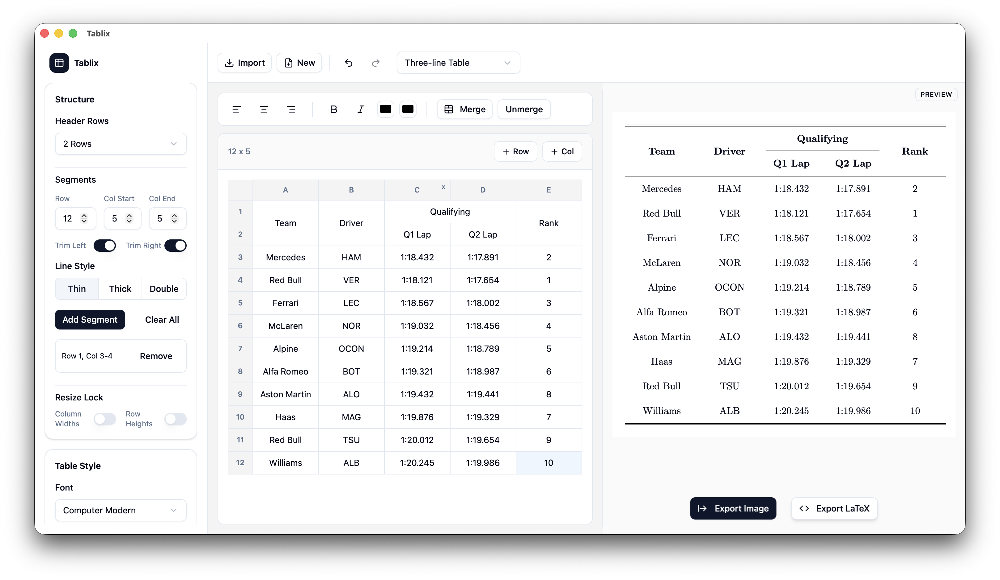

<div align="center">

# Tablix

A visual academic table editor. Design tables visually, then export them to LaTeX or high-resolution images in one click — no more hand-writing `tabular` markup.


**[简体中文](README.md)**

</div>

---

## Features

| | | |
|---|---|---|
| **Academic styling** | **Live preview** | **Formula editor** |
| Built-in `Booktabs`, `Bordered`, and `Minimal` presets, or fine-tune every border, font, and spacing detail. | A live preview pane renders your table exactly as it will appear — zoom and pan at any scale. | A MathLive-powered visual equation editor with KaTeX rendering. |
| **Advanced editing** | **Smart import** | **Multiple export formats** |
| Merge/unmerge cells, multi-row headers, custom rule segments, row/column resize locking, and undo/redo history. | Import **CSV, TSV, XLSX, XLS**, or paste tabular data straight from Excel / the web. | Export **LaTeX** (plain or styled), **PNG** (96–600 DPI), or **SVG**. |

## Screenshot



## Quick start

### Browser (Web only)

```bash
# 1. Install dependencies
npm install        # or: pnpm install / yarn

# 2. Start the dev server
npm run dev
```

Open <http://localhost:5173> (or the URL shown in your terminal).

### Desktop app (Tauri)

Tablix is also available as a desktop application. You'll need the [Tauri prerequisites](https://v2.tauri.app/start/prerequisites/) (Rust toolchain + platform tools) installed first.

```bash
# Run the desktop app in development
npm run tauri:dev

# Build the desktop bundle
npm run tauri:build
```

## How to use

1. **Import or start fresh** — click **Import** to load a CSV/XLSX file, or **New** to create a blank table.
2. **Edit your cells** — click a cell to type, drag to select multiple cells, then use the edit toolbar for bold, italic, alignment, text/background colors, and merging.
3. **Style the table** — use the left sidebar to pick a preset, font, font size, padding, border rules, header rows, and canvas size.
4. **Export** — click **Export Image** (PNG/SVG at your chosen DPI) or **Export LaTeX** (with or without embedded styles).

## Development

### Project structure

```
tablix/
├── src/                     # Svelte 5 frontend
│   ├── lib/
│   │   ├── components/      # UI + table editor components
│   │   │   ├── table/       # AcademicTable, cells, row/column resizers
│   │   │   ├── math/        # MathLive formula dialog
│   │   │   └── ui/          # shadcn-svelte style UI primitives
│   │   ├── stores/          # Central table state + undo/redo history
│   │   ├── utils/           # LaTeX processing, import, export helpers
│   │   └── types.ts         # Core data models (Cell, TableData, styles…)
│   └── routes/              # SvelteKit routes (launch page + editor)
├── src-tauri/               # Tauri (Rust) desktop shell
├── static/                  # Static assets (favicon, screenshot)
├── svelte.config.js         # SvelteKit (adapter-static) config
├── vite.config.ts           # Vite + Tailwind CSS config
├── components.json          # shadcn-svelte config
└── package.json
```

### Core architecture

Editing logic lives in a single reactive store — [`src/lib/stores/table.svelte.ts`](src/lib/stores/table.svelte.ts) — which owns the table data, style, selection, and a full undo/redo history. Both the editor and the preview render from the same source of truth.

- **Rendering** — [`AcademicTable.svelte`](src/lib/components/table/AcademicTable.svelte) draws the table to match the selected style (fonts, borders, paddings, rule segments).
- **LaTeX export** — [`export-latex.ts`](src/lib/utils/export-latex.ts) generates `tabular` code, mapping the visual style to `\toprule`, `\midrule`, `\bottomrule`, `\multirow`, `\multicolumn`, `\makecell`, etc.
- **Import / paste** — [`import.ts`](src/lib/utils/import.ts) parses CSV/TSV/Excel/HTML-table clipboard data.
- **Math** — [`FormulaDialog.svelte`](src/lib/components/math/FormulaDialog.svelte) provides a visual equation editor that inserts `$…$` LaTeX into cells.

### Available scripts

| Command | Description |
|---|---|
| `npm run dev` | Start the Vite dev server |
| `npm run build` | Build the static production bundle |
| `npm run preview` | Preview the production build locally |
| `npm run check` | Type-check with `svelte-check` |
| `npm run tauri:dev` | Run the Tauri desktop app in dev mode |
| `npm run tauri:build` | Build the Tauri desktop app |

## Tech stack

- **[Svelte 5](https://svelte.dev)** — Runes-based reactive frontend framework
- **[SvelteKit](https://kit.svelte.dev)** — Metaframework with `adapter-static`
- **[Tauri 2](https://v2.tauri.app)** — Lightweight desktop shell (Rust backend)
- **[Tailwind CSS 4](https://tailwindcss.com)** — Styling
- **[shadcn-svelte](https://www.shadcn-svelte.com)** — UI primitives
- **[MathLive](https://cortexjs.io/mathlive/)** + **[KaTeX](https://katex.org)** — Math editing & rendering
- **[PapaParse](https://www.papaparse.com)** / **[SheetJS](https://sheetjs.com)** — CSV / Excel parsing
- **[html-to-image](https://github.com/bubkoo/html-to-image)** — PNG / SVG export

## Roadmap

- [x] Table creation, editing, and cell merging
- [x] Academic style presets (Booktabs / Bordered / Minimal)
- [x] LaTeX export (plain + styled)
- [x] PNG / SVG image export
- [x] CSV / Excel import & paste
- [x] Formula insertion (MathLive)
- [ ] Native file save / open (`.tablix`)
- [ ] Undo/redo for style history
- [ ] More canvas presets & alignment guides

## Contributing

Contributions are welcome! Feel free to open an [issue](../../issues) or submit a [pull request](../../pulls).

1. Fork the repository.
2. Create a feature branch: `git checkout -b feat/my-feature`.
3. Commit your changes: `git commit -m 'feat: add my feature'`.
4. Push to the branch and open a PR.

## License

Distributed under the MIT License. See [`LICENSE`](LICENSE) for more information.
